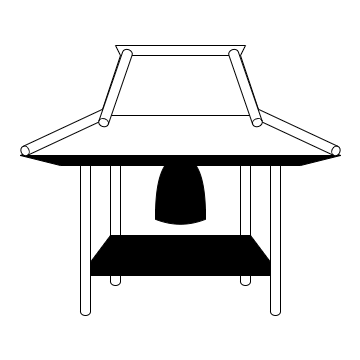

# Terrakko



Terrakko is a provisioning tool that can operate Proxmox VE VM instances on Discord.

```text
                                              _  
  _____  _____ ____  ____  ____  _  __ _  __ |_\_  
 /__ __\/  __//  __\/  __\/  _ \/ |/ // |/ //\_  \_  
   / \  |  \  |  \/||  \/|| /_\||   / |   /|_  \_  \  
   | |  |  /_ |    /|    /| | |||   \ |   \| \_  \__|  
   \_/  \____\\_/\_\\_/\_\\_/ \/\_|\_\\_|\_\\__\___/  
  
```

---

## 目次

- [Terrakko](#terrakko)
  - [目次](#目次)
  - [Terrakkoとは？](#terrakkoとは)
  - [事前要件](#事前要件)
  - [使い方](#使い方)
    - [メニューを呼び出す](#メニューを呼び出す)
    - [ユーザ情報をTerrakkoに登録する](#ユーザ情報をterrakkoに登録する)
    - [VMを作成する](#vmを作成する)
    - [VMの電源を操作する](#vmの電源を操作する)
    - [VMを削除する](#vmを削除する)

## Terrakkoとは？

TerrakkoはDiscordから簡単な操作でNekko CloudのVMインスタンスの作成・変更・削除が行える対話型のコンソールです．  
Terrakkoに予めユーザ名・パスワード・SSHキーを登録することで，Proxmox VEのWebコンソールにアクセスしなくても，VM作成からSSH接続までの一連の操作がDiscordとターミナルで完結します．  

## 事前要件

- SSH公開鍵の作成(パスワード認証を使用する場合は不要)

## 使い方

### メニューを呼び出す

- メニューを呼び出すコマンドは `@terrakko !` または `trk!`
  - `@terrakko !`: メンション + 空白 + !
  - `trk!`: trk + !  

    

- 各操作のセッションは180秒なのでセッションが切れた場合は再度コマンドを送信してください．

### ユーザ情報をTerrakkoに登録する

- メニューから `Configure your info` ボタンをクリックする
- 入力フォームが表示されるので，指定の情報を入力する[^1]  

    

[^1]: 後から情報の変更を行う際も同様の手順で可能です

### VMを作成する

- `Create your VM` をクリック
- VMの個数を選択[^2]  

    

- VMの名前を入力する 
    
    

- 作成されるVMの情報を確認する  

  

  - `Yes`: VMを作成  
  - `No`:  キャンセル  

    

[^2]: 一度に作成できるVMの最大数は5個までです

### VMの電源を操作する

- `Show VM info` をクリック  
- 操作対象のVMを選択する  
  - 表示されるVMはdev環境に存在するユーザ (ここではcyokozai) のVM  
  - 試しに先ほど作成した `test` VMを選択する  

    

- 選択したVMの情報とVMの電源に関するボタンが表示される
  - 表示される情報は以下の通り  

    | 項目      | 詳細                                          |
    | :-------- | :-------------------------------------------- |
    | VM Name   | DiscordのUUID + VMの名前                      |
    | VMID      | PVEが管理するVM固有のID                       |
    | Region    | VMのリージョン[mk/ur/tu]                      |
    | Status    | VMの状態[running/stopped]                     |
    | Host Name | Service Discoveryが提供するVM固有のドメイン名 |
    | IPv4/v6   | VMのIPアドレス                                |

    - 電源に関する操作は以下の通り  
        `Start`: VMを起動する (Status: stoppedの場合のみ)  
        `Shutdown`: VMをシャットダウンする (Status: runningの場合のみ)
        `Reboot`: VMを再起動する (Status: runningの場合のみ)
        `Stop`: VMを強制的に停止する [^3] (Status: runningの場合のみ)

    

[^3]: `Stop` は正常終了ではないため，通常は `Shutdown` の使用を推奨する  

### VMを削除する

- `Delete VM` をクリック
- 削除対象のVMを選択する  
  - 表示されるVMはdev環境に存在するユーザ (ここではcyokozai) のVM  
  - 試しに先ほど作成した `test` VMを選択する  

    

- 選択したVMの情報が表示される

    

- VMの削除を実行するか最終確認を行う
  - `Yes`: VMを削除  
  - `No`:  キャンセル  

    
