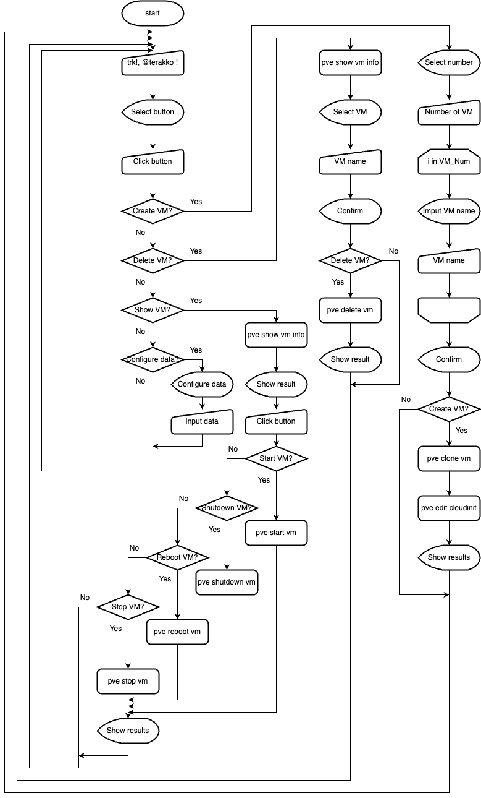
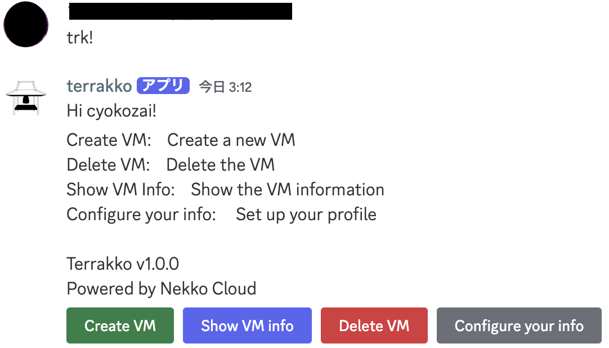
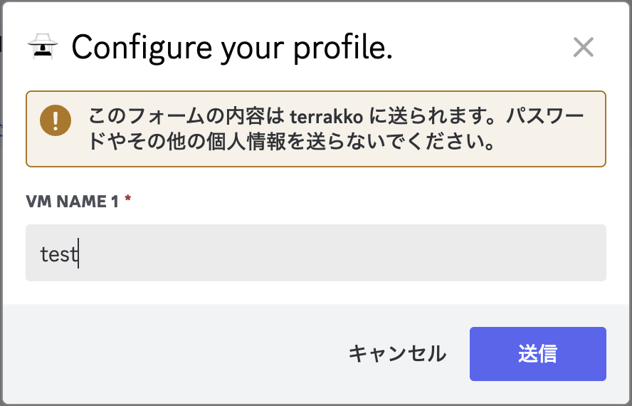
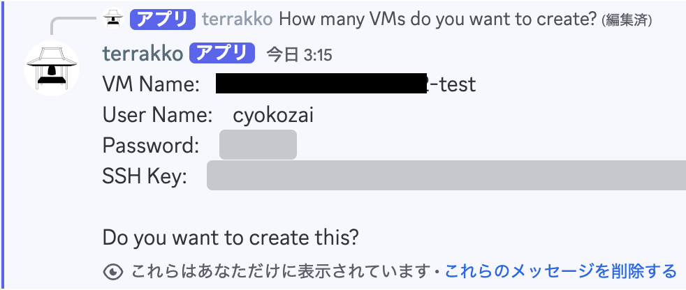
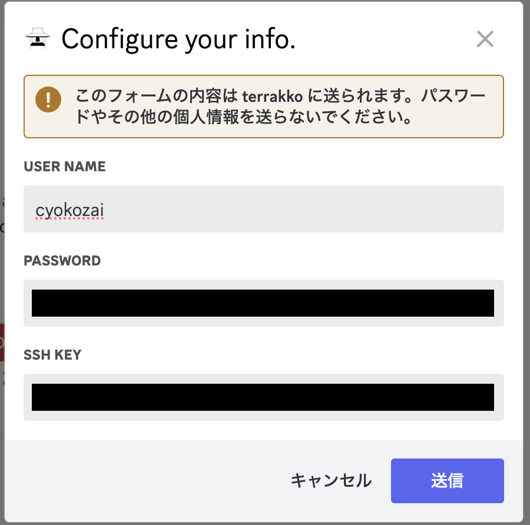

# Terrakko


Terrakko is a provisioning tool that can operate Proxmox VE VM instances on Discord.

```text
                                              _  
  _____  _____ ____  ____  ____  _  __ _  __ |_\_  
 /__ __\/  __//  __\/  __\/  _ \/ |/ // |/ //\_  \_  
   / \  |  \  |  \/||  \/|| /_\||   / |   /|_  \_  \  
   | |  |  /_ |    /|    /| | |||   \ |   \| \_  \__|  
   \_/  \____\\_/\_\\_/\_\\_/ \/\_|\_\\_|\_\\__\___/  
  
```

---

## Environments

- Docker
  - Debian GNU/Linux 12 bookworm
  - [Python:3.11](https://hub.docker.com/_/python/)

## Requirements

### Tools

- `GCC`: 12.2.0 (Debian 12.2.0-14)
- `pip`: 24.2 (Python3.11)
- `libsqlite3-dev`: 3.46.1-1
- `Cloud-init`: 24.1.3-0 ubuntu1~22.04.5
- [ubuntu22.04server-cloudimg](https://cloud-images.ubuntu.com/releases/22.04/release/)

### Proxmox VE Privileges

  | Privileges                | Details                                                 |
  | ------------------------- | ------------------------------------------------------- |
  | `VM.Clone`                | Clone a VM from a VM template.                          |
  | `VM.Monitor`              | Obtaining information about the VM, such as IP address. |
  | `VM.PowerMgmt`            | Start and stop VMs.                                     |
  | `VM.Audit`                | Audit the entire VM.                                    |
  | `VM.Allocate`             | Allocate resources to new VMs.                          |
  | `VM.Config.Cloudinit`     | API for Cloud-init related settings.                    |
  | `SDN.Use`                 | Use SDN.                                                |
  | `Datastore.AllocateSpace` | Required to allocate storage space to the data store.   |

### Python Libraries ([`requirements.txt`](app/requirements.txt))

  | Package              | Version      |
  | -------------------- | ------------ |
  | [`aiosqlite`](https://aiosqlite.omnilib.dev/en/stable/)| 0.20.0       |
  | [`asyncio`](https://docs.python.org/ja/3/library/asyncio.html)| 3.4.3        |
  | [`bcrypt`](https://github.com/pyca/bcrypt/)| 4.2.0        |
  | [`discord.py`](https://discordpy.readthedocs.io/ja/latest/)| 2.4.0        |
  | [`proxmoxer`](https://proxmoxer.github.io/docs/latest/)| 2.1.0        |
  | [`pysqlite3`](https://github.com/coleifer/pysqlite3)| 0.5.4        |
  | [`python-dotenv`](https://github.com/theskumar/python-dotenv)| 1.0.1        |
  | [`requests`](https://requests.readthedocs.io/en/latest/)| 2.32.3       |
  | [`urllib3`](https://urllib3.readthedocs.io/en/stable/)| 2.2.3        |

## Config

- [Link](config.md)

## Architecture



---

## How to setup this?

- [Link](setup.md)

---

## How to use this?

### Basic usage

- Move to Terrakko channel on Discord
- Send message `@terrakko !` or `trk!`
- Terrakko responses you the operate menu

  

### Configure your info

You can register information about your VM  

- Click `Configure your info`
- Pop up the form

  

- Entry your user name, password, ssh key and send the form

### Create your VM

- Click `Create your VM`
- Select the number of VM (1 ~ 5)

  

- Pop up the form (ex Select 5)
- Enter VM name and send the form

  

- Confirm the VM information

  

  - Click `Yes`: Create VM
  - Click `No`: Cancel

    

### Operate your VM

- Click `Show VM info`
- Select VM (You can only view your own VMs.)
- Terrakko responses you the operate menu

  

- Click `Start`
- Click `Shutdown`
- Click `Reboot`
- Click `Stop`

### Delete your VM

- Click `Delete VM`
- Select VM (You can only view your own VMs.)
- Confirm the VM
  - Click `Yes`: Delete VM
  - Click `No`: Cancel

---

## Contact Us

- <networkcontentslab@gmail.com>
