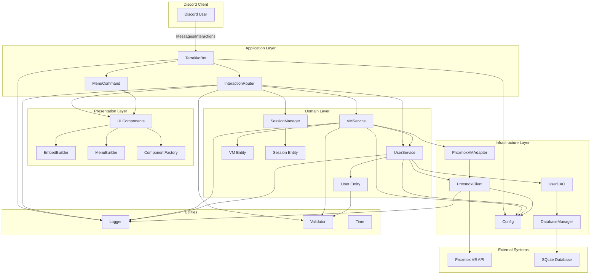
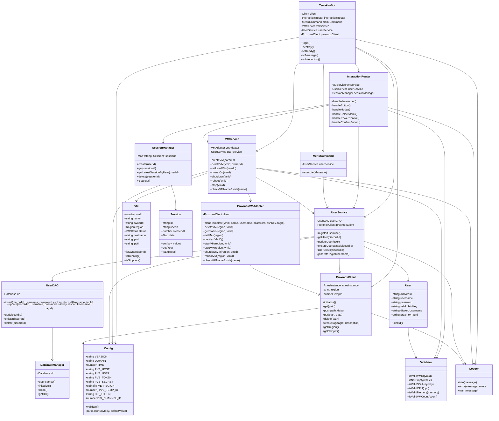
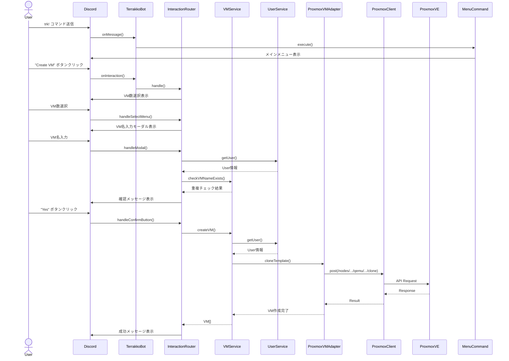
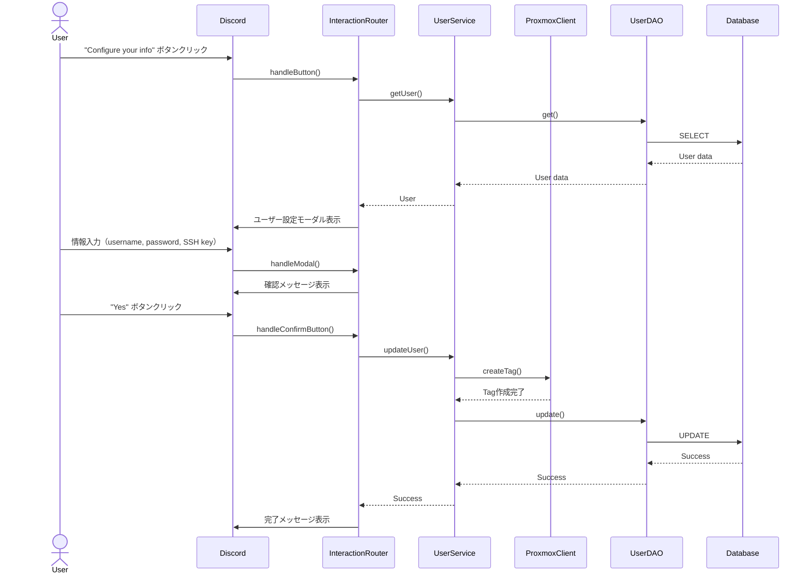
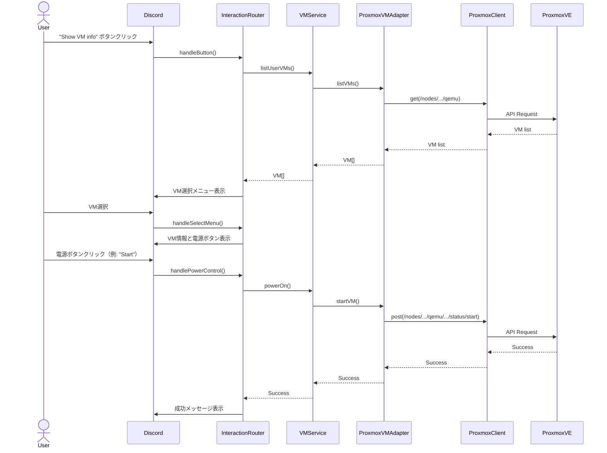

# Terrakko Architecture Documentation

## 概要

TerrakkoはDiscord.jsを使用したTypeScript製のDiscord Botアプリケーションです。Proxmox VE APIを通じてVM（仮想マシン）の作成・管理を行い、ユーザーがDiscord上で簡単にVMを操作できるようにします。

## 技術スタック

- **言語**: TypeScript
- **ランタイム**: Node.js 18+
- **Discordライブラリ**: Discord.js v14
- **データベース**: SQLite (better-sqlite3)
- **HTTPクライアント**: Axios
- **テストフレームワーク**: Jest + ts-jest
- **環境変数管理**: dotenv

## アーキテクチャ概要

Terrakkoは**レイヤードアーキテクチャ**を採用しており、以下の層で構成されています:

1. **Presentation Layer (UI)**: Discord UI コンポーネント（Embed、Button、Select Menu）
2. **Application Layer (Bot/Commands)**: Discordイベント処理とルーティング
3. **Domain Layer**: ビジネスロジック（VM、User、Session管理）
4. **Infrastructure Layer**: 外部システムとの通信（Proxmox API、Database）
5. **Utilities Layer**: 共通ユーティリティ（Logger、Validator、Time）

## システムアーキテクチャ図



## クラス依存関係図



## データフロー

### 1. VM作成フロー



### 2. ユーザー登録フロー



### 3. VM電源操作フロー



## ディレクトリ構造

```
app/
├── src/
│   ├── bot/                     # Application Layer
│   │   ├── TerrakkoBot.ts       # メインBotクラス
│   │   └── InteractionRouter.ts # Interactionルーティング
│   ├── commands/                # Command handlers
│   │   └── MenuCommand.ts       # メニューコマンド
│   ├── domain/                  # Domain Layer
│   │   ├── session/
│   │   │   ├── Session.ts       # セッションエンティティ
│   │   │   └── SessionManager.ts # セッション管理
│   │   ├── user/
│   │   │   ├── User.ts          # ユーザーエンティティ
│   │   │   └── UserService.ts   # ユーザービジネスロジック
│   │   └── vm/
│   │       ├── VM.ts            # VMエンティティ
│   │       ├── VMService.ts     # VMビジネスロジック
│   │       └── VMRepository.ts  # VMリポジトリインターフェース
│   ├── infrastructure/          # Infrastructure Layer
│   │   ├── config/
│   │   │   └── Config.ts        # 環境変数管理
│   │   ├── db/
│   │   │   ├── Database.ts      # SQLiteデータベース管理
│   │   │   └── UserDAO.ts       # ユーザーデータアクセス
│   │   └── proxmox/
│   │       ├── ProxmoxClient.ts # Proxmox APIクライアント
│   │       └── ProxmoxVMAdapter.ts # VM操作アダプター
│   ├── types/                   # 型定義
│   │   ├── InteractionContext.ts
│   │   ├── Region.ts
│   │   └── VMStatus.ts
│   ├── ui/                      # Presentation Layer
│   │   ├── ComponentFactory.ts  # UIコンポーネント生成
│   │   ├── EmbedBuilder.ts      # Embed生成
│   │   └── MenuBuilder.ts       # メニュー生成
│   ├── utils/                   # Utilities
│   │   ├── Logger.ts            # ロギング
│   │   ├── Time.ts              # 時間ユーティリティ
│   │   └── Validator.ts         # バリデーション
│   └── index.ts                 # エントリーポイント
├── jest.config.js               # Jest設定
├── jest.setup.js                # Jestセットアップ
├── package.json                 # NPM設定
├── tsconfig.json                # TypeScript設定
├── .env.test                    # テスト環境変数
└── db/                          # SQLiteデータベース
    └── userdata.db
```

## 主要コンポーネントの責務

### Application Layer

#### TerrakkoBot
- Discord Clientの初期化と管理
- Discord イベント（ready, messageCreate, interactionCreate）の処理
- 各種サービスの初期化と依存性注入
- グレースフルシャットダウンの実装

#### InteractionRouter
- Discord Interactionの種類判定とルーティング
- Button、Modal、SelectMenu の各Interactionハンドラー
- セッション管理を使った状態管理
- VM操作と確認フローの実装

#### MenuCommand
- テキストコマンド（`trk!`）の処理
- メインメニューの表示
- ユーザー存在確認と自動登録

### Domain Layer

#### VMService
- VM作成・削除のビジネスロジック
- VM一覧取得とフィルタリング
- VM電源操作（起動、停止、再起動、シャットダウン）
- VM名の重複チェック

#### UserService
- ユーザー登録・更新
- Proxmox Tag IDの生成と作成
- ユーザー情報の取得と検証
- デフォルトユーザーの自動作成

#### SessionManager
- セッションの作成・取得・削除
- セッションタイムアウト管理
- ユーザーごとの最新セッション取得

### Infrastructure Layer

#### ProxmoxClient
- Proxmox VE APIへのHTTPリクエスト
- Token認証の管理
- リージョンとテンプレートIDの管理
- エラーハンドリングとログ記録

#### ProxmoxVMAdapter
- VMのクローン作成
- VM情報の取得
- VM操作（電源管理）の実装
- 次に利用可能なVMIDの取得

#### DatabaseManager & UserDAO
- SQLiteデータベースの初期化
- ユーザーデータのCRUD操作
- トランザクション管理

### Presentation Layer

#### ComponentFactory
- Discord UIコンポーネント（Button、SelectMenu、Modal）の生成
- 動的なコンポーネント生成（VM数、VM選択など）

#### EmbedBuilder
- Discord Embedの生成
- エラー、成功、VM情報のEmbed

#### MenuBuilder
- メインメニューの構築
- VM情報メニューの構築

### Utilities

#### Validator
- VMID、SSH公開鍵、CPU、メモリ、VM数のバリデーション
- 文字列の空チェック

#### Logger
- 構造化ログ出力
- エラーログとスタックトレース記録

#### Config
- 環境変数の読み込みと検証
- JSON形式の環境変数パース

## 設計パターン

### 1. レイヤードアーキテクチャ
各レイヤーが明確に分離され、依存関係は上位レイヤーから下位レイヤーへの一方向のみです。

### 2. Repository パターン
`ProxmoxVMAdapter`が`VMRepository`インターフェースを実装し、データアクセスをカプセル化しています。

### 3. Service パターン
`VMService`と`UserService`がビジネスロジックをカプセル化し、ドメイン層の中心となっています。

### 4. Factory パターン
`ComponentFactory`、`MenuBuilder`、`EmbedBuilder`がUIコンポーネントの生成を担当しています。

### 5. Singleton パターン
`DatabaseManager`がシングルトンパターンを使用してデータベース接続を管理しています。

### 6. Adapter パターン
`ProxmoxVMAdapter`がProxmox APIを内部のVMドメインモデルに変換しています。

## セキュリティ考慮事項

1. **環境変数の管理**: 機密情報（Token、パスワード）は環境変数で管理
2. **入力バリデーション**: すべてのユーザー入力をValidatorクラスで検証
3. **権限チェック**: VM操作時にオーナー確認を実施
4. **HTTPS通信**: Proxmox APIとの通信はHTTPS（証明書検証は無効化）
5. **SQLインジェクション対策**: better-sqlite3のパラメータバインディングを使用
6. **セッション管理**: タイムアウト機能付きセッション管理

## テスト戦略

- **単体テスト**: Jestを使用したユーティリティクラスのテスト
- **統合テスト**: サービス層のテスト（Configとの連携）
- **環境分離**: `.env.test`を使用したテスト専用環境

テストカバレッジ目標:
- Utilities: 100%
- Domain Layer: 80%以上
- Infrastructure Layer: 70%以上

## 今後の拡張性

1. **マルチリージョン対応の強化**: リージョン選択機能の追加
2. **VM監視機能**: VM使用状況のモニタリング
3. **権限管理**: ロールベースアクセス制御（RBAC）
4. **VM テンプレートカスタマイズ**: ユーザーごとのテンプレート選択
5. **通知機能**: VM状態変化の自動通知
6. **スケジューリング**: VM自動起動・停止のスケジュール設定
