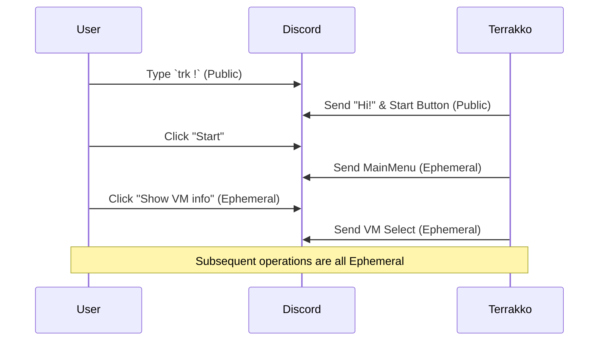

# Problem Space: Terrakko UI/UX Improvement

## 1. Current UI Flow Analysis
The current interaction follows a "Public-to-Private" transition model.

## 2. Identified Features
- **Hierarchical Navigation:** Guided flow using Buttons and Select Menus.
- **Privacy Protection:** Use of Ephemeral messages for sensitive data (VM lists, IDs).
- **Access Control:** User session validation to prevent unauthorized interaction with menus.

## 3. Identified Pain Points & Issues
### Noise & Privacy
- **Channel Pollution:** Starting any operation leaves a trail of public messages (`trk !` command and the bot's intro message).
- **Visibility of Intent:** Even if the details are private, the fact that a user is using Terrakko is visible to everyone.

### Accessibility & Persistence
- **Transient UI:** Ephemeral messages are lost once closed or after a timeout. Users must restart from the beginning.
- **Multi-step Friction:** Users cannot perform direct actions (e.g., "Start VM 101") without navigating through the main menu.

### Input Assistance
- **Legacy Commands:** Use of prefix commands (`trk !`) lacks modern features like autocomplete, type hinting, and command descriptions available in Slash Commands.

### Lack of Personal Space
- **DM Underutilization:** Settings and complex dialogs occupy channel space (even if ephemeral) instead of a dedicated personal DM thread.
