# Solution Space: Next-Generation Terrakko UI/UX

## 1. Core Architecture Concept
A stateless, asynchronous, and DM-centric interaction model integrated with Keycloak for secure authentication.

```mermaid
graph TD
    %% User 0001 Flow
    subgraph User_0001 ["uuid: 0001"]
        A1["/terrakko login"] -->|Mapping UUID to PVE/Keycloak| B1["Move to DM, Start Session"]
        B1 --> C1["/terrakko start test-srv"]
        C1 --> D1["Start test-srv (Async)"]
        D1 --> E1["Report Success/Failure"]
    end

    %% User 0002 Flow
    subgraph User_0002 ["uuid: 0002"]
        A2["/terrakko login"] -->|Mapping UUID to PVE/Keycloak| B2["Move to DM, Start Session"]
        B2 --> C2["/terrakko start my-linux"]
        C2 --> D2["Start my-linux (Async)"]
        D2 --> E2["Report Success/Failure"]
    end

    style User_0001 fill:#f9f9f9,stroke:#333,stroke-width:1px
    style User_0002 fill:#f9f9f9,stroke:#333,stroke-width:1px
```

## 2. Key Features

### 2.1. DM-Based Private Session
- **Noise Reduction:** All granular operations (VM lists, status updates) occur in DMs.
- **Context Persistence:** DM history acts as a personal log of VM operations.

### 2.2. Keycloak Authentication Integration
- **Identity Linkage:** Securely link Discord UUIDs to Keycloak-managed PVE accounts.
- **Zero-Password Storage:** No storage of PVE passwords within the bot. Use API Tokens or OIDC-derived sessions.

### 2.3. Tag-Based Resource Ownership
- **Tag Implementation:** Resources are tagged with `discord_[uuid]`.
- **Filtering:** The bot only shows and allows operations on resources matching the user's tag.

### 2.4. Non-Blocking Async Operations
- **Task Delegation:** Use `asyncio.create_task` to monitor Proxmox tasks in the background.
- **Concurrent Execution:** Multiple users can start/stop VMs simultaneously without blocking the bot's responsiveness.

## 3. Security Roadmap (Reflecting Audit Findings)
1. **Remove `verify_ssl=False`:** Enforce CA certificate verification for all PVE API calls.
2. **Eliminate `PVE_PASS` usage for users:** Use randomly generated initial passwords for Cloud-init, or prompt via Modal.
3. **Formalize Slash Commands:** Implement Autocomplete for VM IDs based on owned tags.
